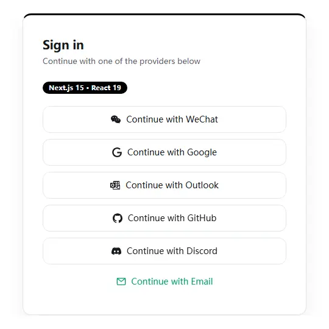
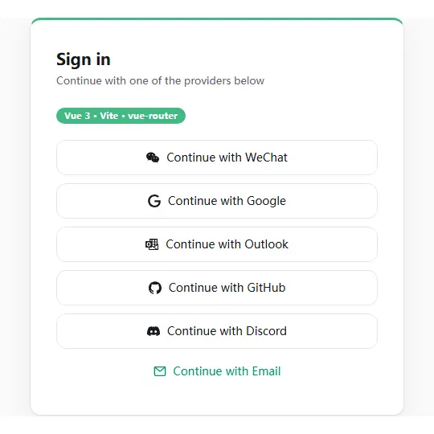

# aardwin SDKs

**English** | [中文](./README.zh-CN.md)

One OAuth login for WeChat, Google, Outlook, GitHub, Discord and email OTP. Drop the `<aardwin-auth>` Web Component into any framework, verify the callback server-side, and every aardwin user can sign in to your app — one account across every product that embeds it. Console: **https://aard.win**

▶ 21s demo — same login card in a Next.js app and a Vue app, then the OAuth callback round-trip.

**Same component, two frameworks**

<table>
  <tr>
    <th>Next.js app</th>
    <th>Vue app</th>
  </tr>
  <tr>
    <td></td>
    <td></td>
  </tr>
</table>

## Quickstart

Minimal path — the full guide is in [browser-sdk/SDK.md](browser-sdk/SDK.md).

1. Register a site in the [aard.win console](https://aard.win) → get `site-id` + `client-secret`.
2. Frontend: `npm i @aardwin/auth-browser`, put `<aardwin-auth site-id="..."></aardwin-auth>` on your login page — the user picks a provider, aard.win redirects back with a one-time `code`.
3. Callback route: verify `state`, then call `exchangeCode()` from `@aardwin/auth-server` → user identity → mint your own session. Full checklist: [browser-sdk/SDK.md](browser-sdk/SDK.md).

## Packages

| Package | What it is | Install |
| --- | --- | --- |
| [`@aardwin/auth-browser`](./browser-sdk/README.md) | `<aardwin-auth>` login component + `<aardwin-account>` identity management, Shadow-DOM Web Components, zero dependencies | `npm i @aardwin/auth-browser` |
| [`@aardwin/auth-server`](./server-sdk/README.md) | Server-side code exchange (`exchangeCode`) and account handoff (`createAccountHandoff`); Node / Bun / edge | `npm i @aardwin/auth-server` |

## Examples

- [`examples/nextjs-app`](./examples/nextjs-app) — Next.js App Router app consuming both published packages.
- [`examples/vue-app`](./examples/vue-app) — Vue app embedding the same login card.

## Links

- Console & docs entry: [https://aard.win](https://aard.win)
- Browser SDK: [browser-sdk/README.md](./browser-sdk/README.md) · [browser-sdk/SDK.md](./browser-sdk/SDK.md)
- Server SDK: [server-sdk/README.md](./server-sdk/README.md)
- License: [MIT](./browser-sdk/LICENSE)
- 中文文档: [README.zh-CN.md](./README.zh-CN.md)
