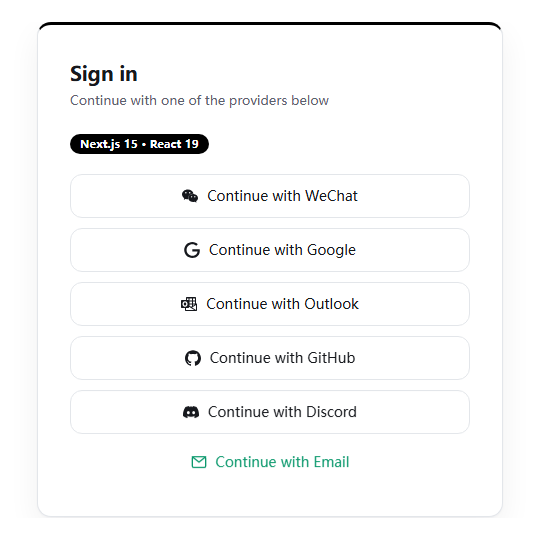
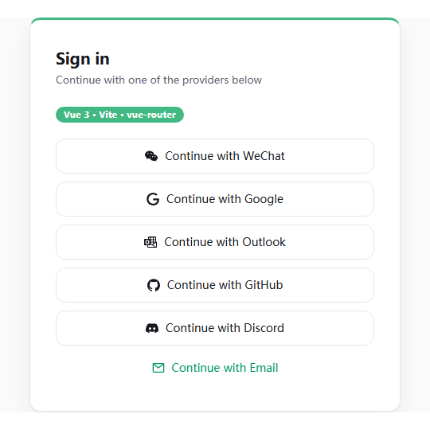

# @aardwin/auth-browser

[](https://www.npmjs.com/package/@aardwin/auth-browser)
[](./LICENSE)

**中文** | [English](./README.md)

可嵌入的 `<aardwin-auth>` OAuth 登录 Web Component（微信、Google、Outlook、GitHub、Discord、邮箱验证码）：Shadow DOM、零依赖，任意框架可用。同包附带 `<aardwin-account>` 身份管理组件（内联绑定 / 解绑）。

## 安装 + 最小用法

```bash
npm install @aardwin/auth-browser
```

```ts
import '@aardwin/auth-browser'; // side-effect：注册 <aardwin-auth> 与 <aardwin-account>
```

```html
<aardwin-auth site-id="YOUR_SITE_ID"></aardwin-auth>
```

不用打包器？构建 IIFE 产物（`bun run build:iife` → `dist/aardwin-auth.iife.js`），用 `<script>` 标签引入：

```html
<script src="/aardwin-auth.iife.js"></script>
<aardwin-auth site-id="YOUR_SITE_ID"></aardwin-auth>
```

元素会从 aardwin API 拉取你站点配置的 provider 列表，按 provider 渲染按钮 —— 你永远不需要硬编码 provider。按钮顺序固定：微信 → Google → Outlook → GitHub → Discord → 邮箱。

## 属性参数

`<aardwin-auth>`：

| 属性 | 必填 | 说明 |
| --- | --- | --- |
| `site-id` | 是 | 在 [aard.win 控制台](https://aard.win) 创建的站点 ID，决定拉取哪些 provider 按钮 |
| `i18n` | 否 | `'zh' \| 'en'`；缺省按 `navigator.language` 自动检测，默认英文 |
| `callback-path` | 否 | 显式指定回调路径（如 `/callback`）；非空时 SDK 在跳转 URL 中追加 `return_url`，缺省时 bff 回退站点注册的 callbackUrl |

`<aardwin-account>`：

| 属性 | 必填 | 说明 |
| --- | --- | --- |
| `site-id` | 是 | 站点 ID；决定可绑定的 provider |
| `code` | 是 | 服务端用 `createAccountHandoff()` 铸造的一次性 handoff code（60 秒、单次使用） |
| `i18n` | 否 | `'zh' \| 'en'`；缺省自动检测 |

React 项目：`import '@aardwin/auth-browser/react.d.ts'` 获得 JSX 类型声明（兼容 React 18 / 19、Next.js 15）。

## 安全模型

- CSRF `state` nonce 由组件自己写入 `SameSite=Lax` cookie（`aard_win_auth_state`），你的回调路由负责校验。
- 前端零密文 —— `client-secret` 只留在你的后端，仅配合 `@aardwin/auth-server` 使用。
- 回调 `code` 一次性（60 秒过期、原子消费）。

## 效果预览

<table>
  <tr>
    <th>Next.js 应用</th>
    <th>Vue 应用</th>
  </tr>
  <tr>
    <td></td>
    <td></td>
  </tr>
</table>

▶ 演示视频：[https://aard.win/sdk-demo.mp4](https://aard.win/sdk-demo.mp4)

## 深入阅读

- 完整集成指南（回调路由、接口契约、排障）：[SDK.md](../server-sdk/SDK.md)
- 服务端换码：[`@aardwin/auth-server`](../server-sdk/README.md)
- 仓库与示例：[aardpro/aardwin-sdk](..)

## 许可证

[MIT](./LICENSE)
